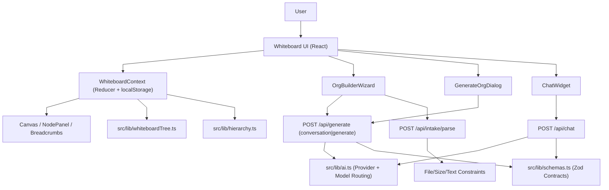

# Architecture Current

Source file:
- `SYSTEM_CONTROL_CENTER/ARCHITECTURE_CURRENT.mmd`

## Ownership
- UI state and behavior: `src/contexts` and `src/components/features`
- API contracts and AI orchestration: `src/app/api` + `src/lib`
- Structural rules: `src/lib/hierarchy.ts` and `src/lib/whiteboardTree.ts`

## Update Trigger
Update this file when:
- API routes or flow shape change
- state orchestration ownership changes
- AI routing path changes
